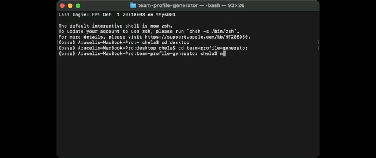
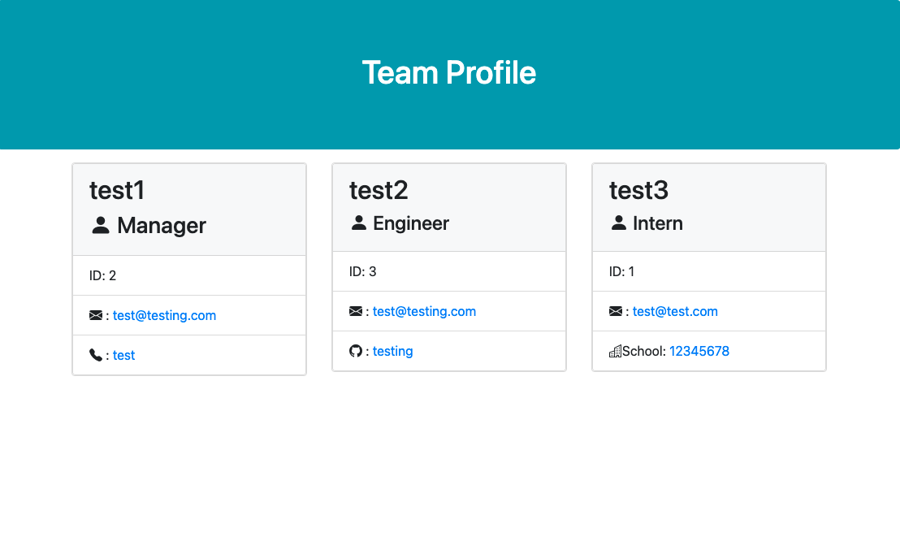

# Team-Profile Generator
A Node.js applicationt that generate a team profile page.

## table of contents 
- [Purpose](#purpose)
- [Technologies-Used](#Technologies-Used)
- [Getting-started](#Getting-started)
- [Contact](#Contact)

## Purpose 
The purpose of this application was to build an application with Node.js that runs through the command line and allows the user to generate a team profile page in a much quicker way. When the application is ran the user is presented with a serious of questions regarding the team members name, role, email, phone number, and extra information specific to each role. The application then generates an HTML page that can be opened on the users default browser. This app is a team profile template generator that doesn't require any coding from the users end. 

## Technologies-Used
- Node.js 
- JEST test
- Javascript
- HTML

## Getting-started
To run the application clone the code and from the root of the project directory run `npm i` to install the necessary packages. From the terminal or command-line run `npm run test` to run the jest test and assure that they all pass. Once you have recieved confirmation of the test passing run `node index.js` to begin the questions prompt. Once all questions have been answered an Html page containing all the inputed information will be generated in `./src/index.html`. Since this is a command-line application no deployed application is available to view, but you can view a walkthrough video at the following link https://watch.screencastify.com/v/4TQ0mx0QeKgY3z6DwEq9.

- initialization of app through terminal

- example of outputed html

## Contact
If you have any questions feel free to contact me through my [Github](https://github.com/Araceli4690).